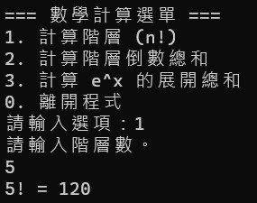
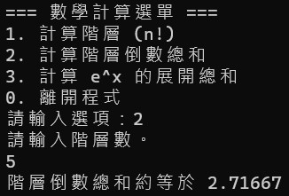
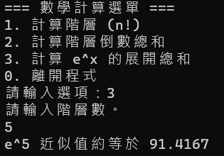
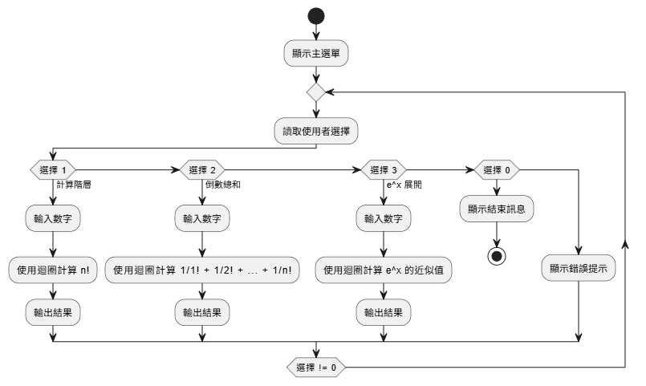

<h1 style="font-size: 28px;">Factorial Calculator - C++ 數學計算小工具</h1>

本專案為 C++ 課堂作業，實作一個互動式數學計算機，包含三種常見運算：<strong>階層</strong>、<strong>階層倒數總和</strong>、<strong>ex 近似展開</strong>。

使用者可透過選單介面選擇想要執行的運算，並由程式進行對應的計算與輸出。

<h2 style="font-size: 20px;">系統畫面展示</h2>

  
  
  

<h2>功能介紹與實作邏輯</h2>
<ul>
  <li>
    <strong>1. 計算階層 (n!)</strong> 
    使用 while 迴圈自 1 累乘至 n，變數 <code>sum</code> 負責存放中間結果，最終輸出 n!。 
    <em>數學公式：</em> n! = 1 × 2 × 3 × ... × n
  </li>
  <li>
    <strong>2. 階層倒數總和</strong> 
    根據數學常數 e 的無限展開式，計算前 n 項的部分和： 
    <code>1 + 1/1! + 1/2! + ... + 1/n!</code>，使用浮點數處理以保留精度。 
    此功能也展示了變數初始化與浮點除法的重要性。 
    <em>應用背景：</em> 為數學常數 e ≈ 2.71828 的一種近似計算方式。
  </li>
  <li>
    <strong>3. ex 的泰勒展開近似值</strong> 
    透過泰勒級數展開 ex，計算前 n 項：
    <code>1 + x/1! + x2/2! + x3/3! + ... + xn/n!</code>。 
    程式以 <code>num_1</code> 作為 x 與項數，迴圈內累乘分子 <code>b</code> 及分母 <code>a</code>，再做浮點除法後累加至總和。
  </li>
</ul>

<h2>使用技術與語法</h2>
<ul>
  <li>使用 <code>while</code> 迴圈控制迭代與階層計算</li>
  <li>浮點數 <code>float</code> 處理除法與小數精度</li>
  <li>變數初始化處理避免未定值錯誤</li>
  <li>多函式拆分：<code>main()</code> 控制流程，個別功能封裝為函式</li>
</ul>

<h2>系統流程圖</h2>

